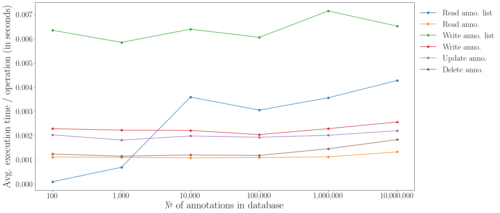

# aiiinotate

aiiinotate is a **fast and lightweight annotation server for IIIF**.

- **aiiinotate relies on** `nodejs/fastify` and `mongodb`
- **provides a REST API** to read/write/update/delete IIIF annotations and index manifests.
- **is distributed as an NPM package**, can be used through NPM or Docker
- **is built for scalability and speed**: [in benchmarks](https://github.com/paulhectork/aiiinotate-benchmark) aiiinotate stores millions of annotations and its response times are always between $$\frac{1}{10}$$ and $$\frac{1}{100}$$ seconds

NOTE: currently, only annotations following the IIIF presentation API 2.0 and 2.1 are supported.

---

## API

See the [docs on the aiiinotate API](https://github.com/Aikon-platform/aiiinotate/blob/dev/docs/api.md).

---

## PROD USAGE

### Install

1. **install mongodb** (see [dev installation script for help](./scripts/setup_mongodb.sh) and checkout the [official installation guide](https://www.mongodb.com/docs/manual/tutorial/install-mongodb-on-ubuntu/#std-label-install-mdb-community-ubuntu))

2. **install aiiinotate**
```bash
npm install aiiinotate
```

### Env definition

#### Basic definition

Copy [`config/.env.template`](./config/.env.template) to `.env` and edit it.

#### Runtime env sourcing

`aiiinotate` runs in a subproicess and won't inherit variables from a plain bash `source` call. Use either of these instead:

1. **`dotenvx` (recommended)**:

```bash
npx dotenvx run -f /path/to/.env -- aiiinotate <command>
```

2. **manual export**:

```bash
set -a && source /path/to/.env && set +a
aiiinotate <command>
```

For clarity, we omit env sourcing from the below commands.

### Setup the app

1. **start `mongod`**

```bash
sudo systemctl start mongod
```

2. **create and configure the database**

```bash
aiiinotate migrate apply
```

### Usage

All commands are accessible through a CLI (`./src/cli`).

#### Run the app

```bash
aiiinotate serve prod
```

#### Run the CLI

The base command is:

```bash
aiiinotate -- <command>
```

It will give full access to the CLI interface of Aiiinotate. Run `aiiinotate --help` for more info.

Use the CLI to:
- import data
- export data
- apply and manage migrations

For more information, see [the CLI docs](https://github.com/Aikon-platform/aiiinotate/blob/main/docs/cli.md).

---

## DOCKER USAGE

See the docs [here](https://github.com/Aikon-platform/aiiinotate/blob/dev/docs/docker.md)

For a Mirador integration, see [the reference implementation](github.com/paulhectork/mirador-aiiinotate/tree/main) (aiiinotate + MongoDB + Mirador 4 + MAE bundled in a single `docker-compose`)

---

## DEV USAGE

### Install

```bash
# clone the repo
git clone git@github.com:Aikon-platform/aiiinotate.git

# move inside it
cd aiiinotate

# install mongodb
bash ./scripts/setup_mongodb.sh

# install node
bash ./scripts/setup_node.sh

# install dependencies
npm i
```

### Setup

After installing, some setup must be done

1. **setup your `.env`** file after [`config/.env.template`](./config/.env.template) and place it at `./config/.env`.

2. **start `mongod`**

```bash
sudo systemctl start mongod
```

3. **configure the database**

```bash
npm run migrate apply
```

### Usage

Remember to have your `mongodb` service running: `sudo systemctl start mongod` !

#### Start the app

```bash
# reload enabled
npm run dev
```

#### Test the app

Note that the tests will probably fail if you set the env variable `AIIINOTATE_STRICT_MODE` to `true`.

```bash
npm run test
```

#### Run the CLI

See [the CLI docs](https://github.com/Aikon-platform/aiiinotate/blob/dev/docs/cli.md) for more info: 

```bash
npm run cli
```

Use the CLI to:
- import data
- export data
- apply and manage database migrations

--- 

## Test coverage

aiiinotate is well tested: **~90% test coverage** on all files ! 

```
ℹ ----------------------------------------------------------------------------------------
ℹ file       | line % | branch % | funcs % | uncovered lines
ℹ ----------------------------------------------------------------------------------------
ℹ all files  |  90.02 |    79.43 |   78.73 |
ℹ ----------------------------------------------------------------------------------------
```

---

## Scalability

In [benchmarks](https://github.com/paulhectork/aiiinotate-benchmark), aiiinotate response times are between 1/100th and 1/10th of a second with up to 10,000,000 annotations. 



See [scalability.md](./docs/scalability.md) for more information.

---

## License

GNU GPL 3.0.
