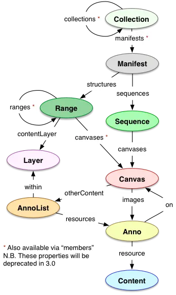

# IIIF ANNOTATIONS

## Specifications

- image API docs [here](https://iiif.io/api/image/3.0/)
- presentation API 2.x [here](https://iiif.io/api/presentation/2.1/) (most widely used)
- presentation API 3.0 [here](https://iiif.io/api/presentation/3.0/) (newest version)
- annotations API docs [here](https://iiif.io/api/annex/openannotation/)

---

## Image API

[https://iiif.io/api/image/3.0/](https://iiif.io/api/image/3.0/)

The Annotation API is based on the IIIF image api. As a reminder, the IIIF image URL anatomy is:

```
{scheme}://{server}{/prefix}/{identifier}/{region}/{size}/{rotation}/{quality}.{format}
```

---

## Relation to the W3C Web Annotation model

[https://iiif.io/api/annex/openannotation](https://iiif.io/api/annex/openannotation)

IIIF is based on the W3C Web Annotation data model, and not just for the IIIF annotations but for all its APIs ! In IIIF annotations, document parts are targeted as `SpecificResource`. The IIIF standard defines several custom selectors to extend the W3C standard. 

### `ImageApiSelector`

Selects an image region in an Image API way. The selector is an *objectified* version of the Image API URL params:

- `type`: `"ImageApiSelector"`
    - must be "ImageApiSelector"
- `region`: 
    - default `"full"`
- `size`: 
    - default `"full"`
- `rotation`: 
    - default `"0"`
- `quality`: 
    - default `"default"`
- `format`: 
    - default `"jpg"`

```js
{
  "type": "SpecificResource",
  "source": "https://example.org/iiif/image1",
  "selector": {
    "type": "ImageApiSelector",
    "region": "pct:0,0,10,10",
    "rotation": "90"
  }
}
```

### `PointSelector`

Selects a Point in an image.

- `type`: `"PointSelector"`
- `x`, `y`: `int`
    - optional
    - integers giving the x and y-coordinates of the point
- `t`: `float`
    - optional 
    - float value describing the time at which the point appears (on a video), in seconds

```js
{
  "type": "PointSelector",
  "x": 10,
  "y": 10,
  "t": 14.5
}
```

### Content Selectors

Out of scope here, but there are `AudioContentSelector` and `VisualContentSelector` to select audio/visual content in a IIIF video.

---

## Presentation API

<table>
    <tr>
        <th>IIIF Presentation 3.0 data model</th>
        <th>IIIF Presentation 2.0 data model</th>
    </tr>
    <tr>
        <td></td>
        <td></td>
    
    </tr>
</table>
