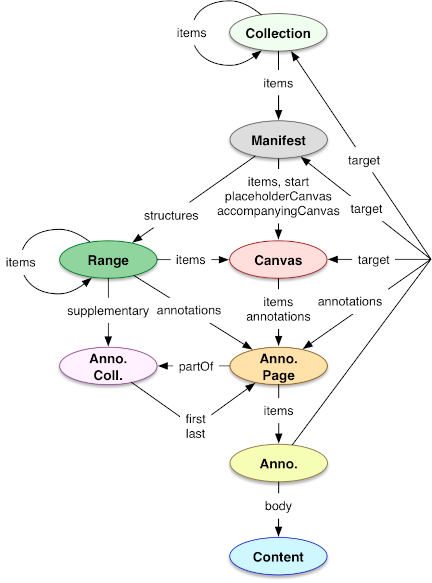
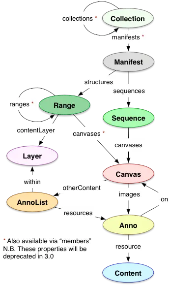

# IIIF ANNOTATIONS

## Specifications

- image API docs [here](https://iiif.io/api/image/3.0/)
- presentation API 2.x [here](https://iiif.io/api/presentation/2.1/) (most widely used)
- presentation API 3.0 [here](https://iiif.io/api/presentation/3.0/) (newest version)
- relationship to the W3C annotations data model [here](https://iiif.io/api/annex/openannotation/)
- IIIF annotation exmple [here](https://iiif.io/api/cookbook/recipe/0266-full-canvas-annotation/)

---

## Image API

[https://iiif.io/api/image/3.0/](https://iiif.io/api/image/3.0/)

The Annotation API is based on the IIIF image api. As a reminder, the IIIF image URL anatomy is:

```
{scheme}://{server}{/prefix}/{identifier}/{region}/{size}/{rotation}/{quality}.{format}
```

---

## Relation to the W3C Web Annotation model

[https://iiif.io/api/annex/openannotation](https://iiif.io/api/annex/openannotation)

IIIF is based on the W3C Web Annotation data model, and not just for the IIIF annotations but for all its APIs ! In IIIF annotations, document parts are targeted as `SpecificResource`. The IIIF standard defines several custom selectors to extend the W3C standard. 

### `ImageApiSelector`

Selects an image region in an Image API way. The selector is an *objectified* version of the Image API URL params:

- `type`: `"ImageApiSelector"`
    - must be "ImageApiSelector"
- `region`: 
    - default `"full"`
- `size`: 
    - default `"full"`
- `rotation`: 
    - default `"0"`
- `quality`: 
    - default `"default"`
- `format`: 
    - default `"jpg"`

```js
{
  "type": "SpecificResource",
  "source": "https://example.org/iiif/image1",
  "selector": {
    "type": "ImageApiSelector",
    "region": "pct:0,0,10,10",
    "rotation": "90"
  }
}
```

### `PointSelector`

Selects a Point in an image.

- `type`: `"PointSelector"`
- `x`, `y`: `int`
    - optional
    - integers giving the x and y-coordinates of the point
- `t`: `float`
    - optional 
    - float value describing the time at which the point appears (on a video), in seconds

```js
{
  "type": "PointSelector",
  "x": 10,
  "y": 10,
  "t": 14.5
}
```

### Content Selectors

Out of scope here, but there are `AudioContentSelector` and `VisualContentSelector` to select audio/visual content in a IIIF video.

---

## Presentation API

<table>
    <tr>
        <th>IIIF Presentation 3.0 data model</th>
        <th>IIIF Presentation 2.0 data model</th>
    </tr>
    <tr>
        <td></td>
        <td></td>    
    </tr>
</table>

### Presentation API 3.0

> NOTE: only some general informations on the manifest and more specific informations for the Annotations are included

#### Terminology

- embedded: a resource that is included in the same document as a parent resource, called the embedder
- referenced: a resource that is not (entierly) present in another resource, and for which it is necessary to fetch the referenced resource's id to retrieve information

#### Ressource types

- `Collection`: an ordered list of Manifests or Collections of Manifests
- `Manifest`: a description of the structure and properties of the compound object (book...)
- `Range`: an ordered list of Canvases, or Range of Canvases
- `Canvas`: a virtual container that represents a particular view of the object and has content resources associated to it. The Canvas allows to describe how content is laid out on it, spatially and temporally. Annotations are used to populate the Canvas with images, text, sound...
- `Annotation Collection`: a list of ANnotation Pages that allows higher level-groupings (different ttranscriptions of a single text may each get their Annotation Collection)
- `Annotation Page`: an ordered list of Annotations associated with a Canvas. Annotation Pages can also provide commentary on a resource that is part of a canvas (like a text commentary for an image)
- `Annotation`: annotations are used to store a canvas' content: image, video, text...

#### Properties

Most can be used on any resource type. Some important properties are:

- `id`: `URI`
    - all resources MUST have an id used to identify the resource
    - if the resource identified by this ID is embedded in another resource, the URI MAY be the URI of the embedding resource with a unique fragment on the end. 
    - canvases MUST have their own URI without a fragment. 
- `type`: `Dataset | Image | Model | Sound | Text | Video | <other>`
    - the class the resource belongs to
- height` and `width`: `int`
    - the height of the Canvas or Content resource. 
    - Canvas MAY have a height AND width, Content resources SHOULD have a height and width. other types MUST NOT have a height.
    - for Content resource, the height/width is in pixels. 
    - for Canvases, it does not have a unit: height and width are used to express the Canvas' apsect ratio
- `viewingDirection`: `left-to-right | right-to-left | top-to-bottom | bottom-to-top`
    - the direction in which to display a set of canvases
    - MAY use this property: Collection, Manifest, Range
    - MUST NOT: all other types

--- 

### Useful links
